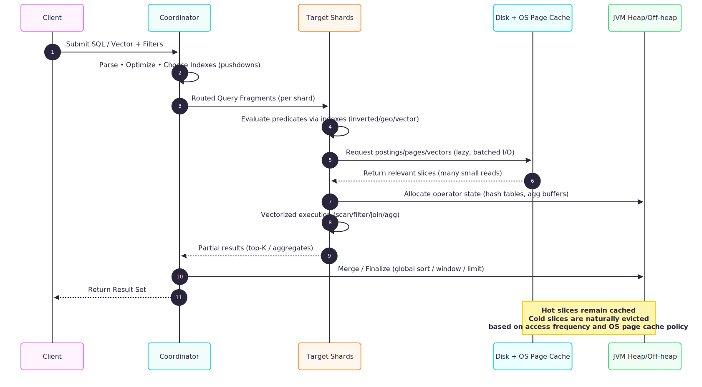

# MonkDB: Adaptive Memory-Oriented Architecture for Multi-Model OLAP Systems

MonkDB introduces a cutting-edge data orchestration model purpose-built for modern analytics and AI workloads.
It combines **Lucene-based indexing, disk-first design**, and **selective in-memory execution** to deliver OLAP-scale performance across time-series, vector, full text search, geospatial, tabular, and document datasets.

# 🧠 Adaptive, Disk-Centric Architecture (Lucene Segment Model)

MonkDB follows a **disk-primary, memory-adaptive architecture**, inspired by advanced analytical engines like CrateDB, Elasticsearch, ClickHouse, and DuckDB Hybrid.

1. **Lucene-backed segment indexing** ensures that every data partition is independently searchable and mergeable.
2. Incoming records first land in **memory buffers** and **transaction logs (WAL)** for durability.
3. After a short refresh interval (typically one second), data is indexed into **in-memory Lucene segments**, becoming immediately searchable.
4. These segments are periodically **flushed and merged to disk**, maintaining compact and performant data storage.

This hybrid write path (Buffer → WAL → Lucene Segment → Disk) enables:

- Near-real-time ingestion
- Low memory footprint
- OLAP-scale querying across billions of records

It is this disk-first, Lucene-segment architecture that allows MonkDB to handle IoT telemetry, AI embeddings, ESG sensor data, and geospatial workloads simultaneously without requiring massive RAM footprints.

## ⚙️ Selective, Lazy, and Predicate-Driven Loading

Unlike traditional systems that pre-load large data blocks, MonkDB employs **selective and predicate-driven loading**, ensuring **only the relevant segments** are accessed per query.

- Queries trigger **lazy fetching**: only shards, columns, and segments matching the predicates are read from disk.
- **Predicate pushdowns** and **index-aware planners** reduce unnecessary scans.
- **Hot segments** remain cached in memory; **cold data** is fetched on-demand.

This is conceptually similar to:

- Snowflake’s micro-partitions
- ClickHouse’s data-skipping indexes
- Elasticsearch’s segment-level caching

This architecture allows analytical (OLAP) and vector/AI workloads to coexist efficiently, even when queries are random, wide, and sparse.

## 🚀 Hybrid Caching and JVM Memory Orchestration

MonkDB’s runtime leverages both Lucene’s internal caches and JVM’s garbage-collected memory management to achieve predictable performance under variable workloads.

- **Application-level caching** (Lucene segments, query results) works hand-in-hand with **runtime-level tuning** (heap sizing, GC policies).
- This ensures stable behavior even under heavy concurrent workloads.
- The heap size per node is configurable, allowing **elastic scaling** and **Kubernetes-friendly** resource allocation.

This hybrid memory orchestration makes MonkDB uniquely capable of running across **ARM64 + x86_64 clusters**, supporting hybrid **edge-cloud deployments** without sacrificing performance or consistency.

## 🔍 Query-Driven Data Residency (Post-Query Loading)

MonkDB’s **post-query** loading model represents a paradigm shift in how analytical databases handle I/O.

- Traditional systems pre-cache or pre-load data blocks, consuming memory unnecessarily.
- MonkDB’s **query-directed I/O** loads only the required data segments after the query planner determines relevance.
- This on-demand model minimizes latency while avoiding overuse of memory.
- The planner intelligently hydrates only the data slices required for the query, combining **OLAP scan efficiency** with **OLTP responsiveness**.

This model mirrors concepts seen in Databricks Photon, DuckDB’s vectorized execution, and adaptive columnar query engines, but applies them to a distributed, multi-model environment.

## 🧩 Multi-Model and AI-Native Synergy

MonkDB is designed for **AI-native analytics** by blending structured, semi-structured, and unstructured data into a unified execution engine.

- The same caching and lazy-loading model supports time-series, JSON, vector, and geospatial data.
- Vector search operations (knn_match, vector_similarity) load only the relevant HNSW index portions into memory, avoiding full-index hydration.
- This creates a unified data plane for both **analytical queries** and **semantic/vector retrieval**, something few systems achieve.

Comparatively:
- Milvus and Pinecone specialize in vectors but lack OLAP joins/filters.
- PostgreSQL + PGVector adds vector functions but suffers from monolithic storage and limited horizontal scalability.
- MonkDB unifies both worlds— AI-native semantics with OLAP-grade performance.

## 🧭 Strategic and Technical Significance

MonkDB represents the next evolutionary stage in distributed analytical databases.

| **Capability**            | **Description**                                             | **Industry Comparison**                     |
|----------------------------|-------------------------------------------------------------|---------------------------------------------|
| **Disk-Primary with Lucene Segments** | Optimized for real-time indexing and sub-second searchability | Similar to **Elasticsearch / CrateDB**      |
| **Selective Data Loading** | Fetches only relevant data partitions and columns on-demand | Similar to **ClickHouse / Snowflake**       |
| **Hybrid Memory Control**  | Combines JVM heap + off-heap + OS cache management          | More advanced than **SingleStore**          |
| **Multi-Model Unification**| Time-series, JSON, Vector, and Geo in one engine            | **Unique** in market                        |
| **AI-Native Integration**  | Vector and embedding search built into query layer          | On par with **Milvus**, but **OLAP-native** |
| **Cloud-Edge Elasticity**  | ARM64/x86, K8s-ready hybrid orchestration                   | Rare in **distributed databases**           |

### Strategic Takeaway:

MonkDB scales **AI + analytics on a unified backbone** leveraging Lucene’s proven search architecture, columnar execution, and intelligent memory orchestration.

It is **multi-model, OLAP-grade, and cloud-native** by design.

## 🧩 Architectural Overview Diagram

### Query Flow

## 🧩 Performance and Operational Considerations

| **Parameter**              | **Purpose**                                            | **Recommendation**                                |
|-----------------------------|--------------------------------------------------------|---------------------------------------------------|
| **Heap Size**               | Controls operator buffers and intermediate results     | Tune based on query concurrency                   |
| **Refresh Interval**        | Frequency of in-memory segment promotion               | Default **1s** (adjust for write-heavy workloads) |
| **Segment Merge Policy**    | Balances write amplification vs. query latency         | Use **tiered merges**, optimize for **SSD I/O**   |
| **Vector Index Parameters** | Control recall/latency trade-off in KNN search         | Tune **HNSW M** |
| **Page Cache Management**   | OS-level caching of segment files                      | Ensure sufficient OS memory outside heap          |
| **GC Strategy**             | Manage long-running queries with minimal pauses        | Use **G1** or **ZGC**, with adaptive pause goals  |

## 🧩 Summary

MonkDB’s architecture embodies **adaptive intelligence in data storage and access**:

- **Disk-first, memory-efficient design** for petabyte-scale workloads
- **Selective and lazy loading** for real-time query optimization
- **Multi-model indexing** across structured, unstructured, and semi-structured data
- **Hybrid memory orchestration** ensuring predictable performance
- **AI-native capability** enabling next-gen analytics and semantic search

**In essence**: MonkDB redefines what a distributed OLAP engine can be— a **single, unified, AI-native analytical** substrate for the next generation of intelligent, scalable data systems.
