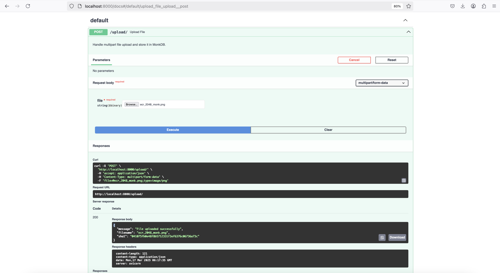
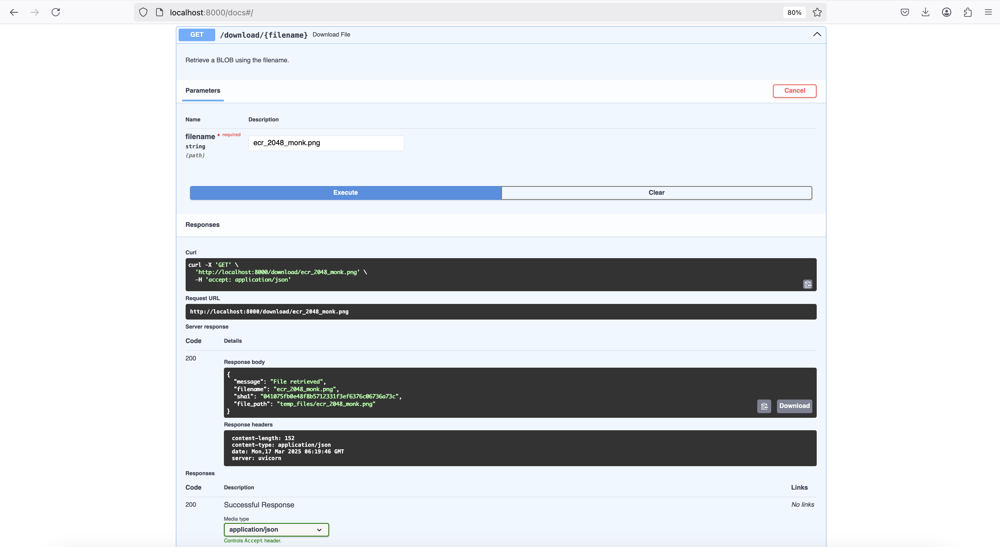
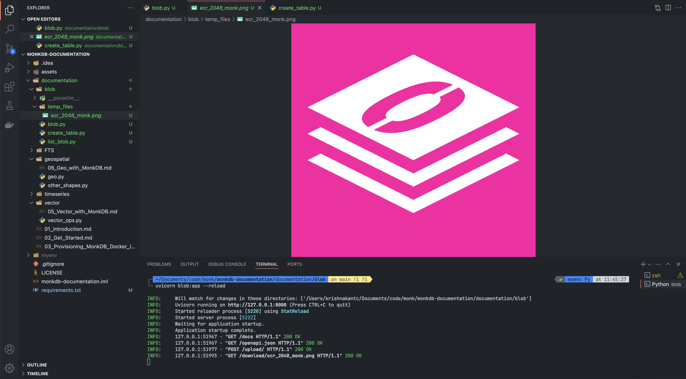
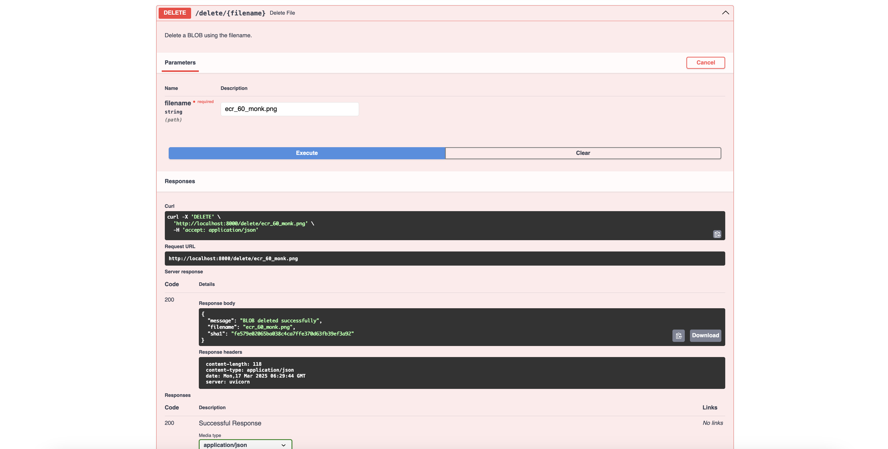

# Working with BLOB Workloads Using MonkDB

MonkDB’s BLOB storage is designed for efficient distributed storage of large binary objects (BLOBs) such as images, videos, PDFs, and other unstructured data. However, unlike traditional object storage systems like Amazon S3, it lacks several advanced features.

Below, we’ll expand on MonkDB’s BLOB functionality, its limitations, and the workarounds to implement missing features.

---

## What Are BLOBs in MonkDB?

- BLOB (Binary Large Object) storage in MonkDB allows storing large, unstructured files.
- It is separate from standard relational tables and does not support SQL operations like SELECT, JOIN, or WHERE filtering on BLOB content.
- Each BLOB is identified by a SHA-1 hash of its content.

✅ Best For:

- Storing images, videos, logs, or large unstructured data that don’t need relational querying.
- Use cases like file archival, media storage, and document management.

---

## Creating and Managing BLOBs

### 🛠 Creating a BLOB Table

```psql
CREATE BLOB TABLE my_blobs
CLUSTERED INTO 3 SHARDS;
```

- `CLUSTERED INTO` controls how many shards the table will be distributed across.

### 🔼 Uploading a File

Since MonkDB BLOB tables do not support `INSERT` statements, you must use an HTTP API to upload files.

```bash
curl -X PUT "http://localhost:4200/_blobs/my_blobs/<SHA1_HASH>" --data-binary @myfile.jpg
```

- Files are referenced only by SHA-1 hash (not filenames).
- If the same file is uploaded again, it won’t be duplicated.

### 🔽 Retrieving a File

```bash
curl -X GET "http://localhost:4200/_blobs/my_blobs/<SHA1_HASH>" -o downloaded.jpg
```

- You must know the SHA-1 hash to retrieve a file.
- There is no way to list all stored BLOBs natively.

### ❌ Deleting a BLOB

```bash
curl -X DELETE "http://localhost:4200/_blobs/my_blobs/<SHA1_HASH>"
```

BLOBs must be deleted by SHA-1 hash.

---

## Features Missing in MonkDB BLOBs (Limitations & Workarounds)

### ❌ 1. No Folder or Directory Structure

🔴 **Problem**: Unlike S3, you cannot create "folders" or "subfolders" inside a BLOB table.

✅ **Workaround**:

Use a metadata table to store logical paths. For Example:

```psql
CREATE TABLE blob_metadata (
    folder_path TEXT,
    filename TEXT PRIMARY KEY,
    sha1sum TEXT UNIQUE
);
```

Query files by folder:

```psql
SELECT filename FROM blob_metadata WHERE folder_path = '/projectX/reports';
```

### ❌ 2. No Built-in Listing of BLOBs

🔴 **Problem**: There is no `SELECT` query or API endpoint to list all BLOBs.

✅ **Workaround**:

Store metadata in a table with `SHA-1` hashes. Retrieve/list stored files:

```psql
SELECT filename, sha1sum FROM blob_metadata;
```

### ❌ 3. No SQL Querying of BLOB Data

🔴 **Problem**: BLOBs are not queryable via **SQL**; they can only be retrieved by `SHA-1`.

✅ **Workaround**:
- Extract text-based data from files before storing and save it in a table. 
- Example: Store image metadata in a relational table.

### ❌ 4. No Moving BLOBs Between Tables

🔴 **Problem**: You cannot move BLOBs from one table to another like in S3.

✅ **Workaround**:

Copy the file to another BLOB table and delete the original:

```psql
INSERT INTO new_blob_table (sha1sum)
SELECT sha1sum FROM old_blob_table WHERE sha1sum = 'sha1hash';

DELETE FROM old_blob_table WHERE sha1sum = 'sha1hash';
```

### ❌ 5. No Renaming or Updating BLOBs

🔴 **Problem**: BLOBs cannot be renamed or modified.

✅ **Workaround**:

Store filenames separately in blob_metadata and update that:

```psql
UPDATE blob_metadata SET filename = 'new_name.jpg' WHERE filename = 'old_name.jpg';
```

### ❌ 6. No Access Control (ACLs, Permissions)

🔴 **Problem**: MonkDB BLOB storage has no built-in authentication.

✅ **Workaround**:

- Use FastAPI or an API Gateway to handle authentication.
- Implement OAuth2, API Keys, or JWT.

### ❌ 7. No Encryption of BLOBs

🔴 **Problem**: MonkDB does not encrypt BLOBs at rest.

✅ **Workaround**:

Encrypt files before uploading using `AES` or `RSA`. Example:

```py
from cryptography.fernet import Fernet
key = Fernet.generate_key()
cipher = Fernet(key)

with open("file.pdf", "rb") as f:
    encrypted_data = cipher.encrypt(f.read())
```

### ❌ 8. No Compression Support

🔴 **Problem**: Files are stored uncompressed.

✅ **Workaround**:

Compress before uploading using `.zip`, `.tar`, or `.gz`.

### ❌ 9. No Versioning Support

🔴 **Problem**: Old versions are not kept if a file is re-uploaded.

✅ **Workaround**:

Store multiple versions with timestamps:

```psql
CREATE TABLE blob_metadata (
    filename TEXT,
    version INT,
    sha1sum TEXT
);
```

Query latest version:

```psql
SELECT sha1sum FROM blob_metadata WHERE filename = 'myfile.pdf' ORDER BY version DES
```

### ❌ 10. No Snapshot Backup for BLOBs

🔴 **Problem**: CREATE SNAPSHOT does not work for BLOB tables.

✅ **Workaround**:

Manually backup files to an external system.

### ❌ 11. No Partial Reads (Byte Ranges)

🔴 **Problem**: You must download the entire file to access a portion.

✅ **Workaround**:

Store file chunks separately.

### ❌ 12. No Auto-Expiry (TTL) for BLOBs

🔴 **Problem**: BLOBs do not expire automatically.

✅ **Workaround**:

Use a cron job to delete old files:

```psql
DELETE FROM blob_metadata WHERE uploaded_at < NOW() - INTERVAL '30 days';
```

## TL,DR;

| ❌ Missing Feature       | ✅ Workaround                          |
|--------------------------|---------------------------------------|
| No folders              | Use folder_path in metadata table     |
| No listing of BLOBs     | Track SHA-1s in a metadata table      |
| No SQL queries          | Store metadata separately             |
| No move operation       | Copy + delete from old table          |
| No renaming             | Store filenames in a separate table   |
| No ACLs                 | Use an API Gateway for authentication |
| No encryption           | Encrypt before uploading              |
| No compression          | Compress before storing               |
| No versioning           | Track versions in a metadata table    |
| No backup support       | Export manually                       |
| No partial reads        | Store files in chunks                 |
| No auto-expiry          | Run a cron job for deletion           |


---

## Outputs

We are pasting screenshots of upload, download and delete BLOBs operations.

### Upload



### Download





### Delete

