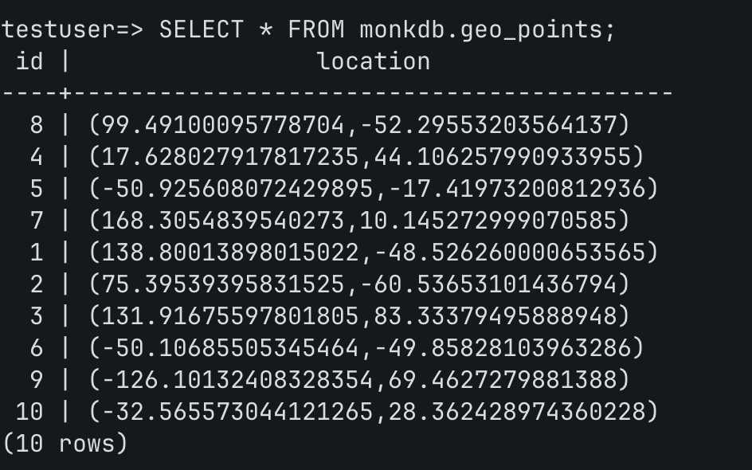
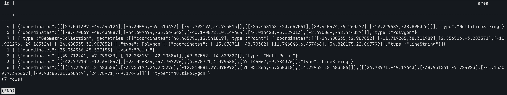

# Working with Geospatial Workloads Using MonkDB

We support efficient ingestion, storage mechanisms and querying on geospatial data. 

With MonkDB, you can do the following (mentioned below):

- We also support sorting or boosting scoring by distance or area prioritizes geospatial search results based on proximity or spatial relationships to enhance relevance and usability.
- Users can filter search results using various techniques, including bounding boxes defined by longitude and latitude, circles specified by a center point and radius, donut shapes that exclude an inner circle, and custom polygons for more complex areas.
- Index various geospatial shapes supported by MonkDB.

We support `geo_point` and `geo_shape` data types. 

`geo_point` store longitudes and latitudes, and `geo_shapes` store *2D shapes* defined as **GeoJSON**. We support `polygon`, `multipoint`, `line string`, `multi line string`, `multi polygon`, and `geometry collection` geometric shapes.

We support *WKT strings* (Well Known Text) and array of double precision long & lats for `geo_points`. For `geo_shapes`, we support *WKT* and GeoJSON objects. 

---

We have simulated two scripts with synthetic data. 

In the [first](geo.py) script, we have only worked on `polygon` shape. In this demo, we are inserting polygon data in WKT format, and trying to query geo_points within a geo_shape (polygon).

The below is the output of the first script post its execution.

```bash
python3 documentation/geospatial/geo.py
```

```bash
Table 'monkdb.geo_points' has been created.
Table 'monkdb.geo_shapes' has been created.
Inserted point ID 1 at location [-132.57216, -52.69326] in monkdb.
Inserted point ID 2 at location [151.582623, 54.153087] in monkdb.
Inserted point ID 3 at location [81.293244, -54.672008] in monkdb.
Inserted point ID 4 at location [102.959424, -79.185535] in monkdb.
Inserted point ID 5 at location [88.458914, -0.367918] in monkdb.
Inserted point ID 6 at location [-138.345894, -28.242759] in monkdb.
Inserted point ID 7 at location [-15.159242, -29.616913] in monkdb.
Inserted point ID 8 at location [5.006293, -5.374171] in monkdb.
Inserted point ID 9 at location [33.150474, -16.879792] in monkdb.
Inserted point ID 10 at location [-164.983769, -53.055628] in monkdb.
Inserted shape ID 1 with WKT: POLYGON ((-21.116987 -15.252228, 2.652011 47.669706, 5.365045 14.547793, -21.116987 -15.252228)) in monkdb.
Inserted shape ID 2 with WKT: POLYGON ((-36.985187 -34.572001, -32.654479 -15.555314, 36.435662 35.521955, 22.220096 11.627303, -36.985187 -34.572001)) in monkdb.
Inserted shape ID 3 with WKT: POLYGON ((15.89106 -43.386096, -39.814844 -28.742565, 9.352968 43.893455, 38.896167 -31.686455, 15.89106 -43.386096)) in monkdb.
Inserted shape ID 4 with WKT: POLYGON ((-15.772757 -7.411465, -34.427736 33.721657, 48.336815 45.988126, 39.783495 9.946578, -15.772757 -7.411465)) in monkdb.
Inserted shape ID 5 with WKT: POLYGON ((45.327418 -41.791533, -41.086429 18.729295, 30.275095 23.680088, 46.047848 0.456104, 45.327418 -41.791533)) in monkdb.

Geo Points:
[8, [5.0062929186969995, -5.37417100276798]]
[4, [102.95942394062877, -79.18553500436246]]
[5, [88.45891392789781, -0.36791802383959293]]
[7, [-15.159242022782564, -29.616913008503616]]
[1, [-132.57216003723443, -52.693260004743934]]
[2, [151.58262295648456, 54.15308696217835]]
[3, [81.29324393346906, -54.67200803104788]]
[6, [-138.3458940591663, -28.24275903403759]]
[9, [33.15047398209572, -16.8797920178622]]
[10, [-164.98376900330186, -53.055628035217524]]

Geo Shapes:
[4, {'coordinates': [[[-15.772757, -7.411465], [-34.427736, 33.721657], [48.336815, 45.988126], [39.783495, 9.946578], [-15.772757, -7.411465]]], 'type': 'Polygon'}]
[1, {'coordinates': [[[-21.116987, -15.252228], [2.652011, 47.669706], [5.365045, 14.547793], [-21.116987, -15.252228]]], 'type': 'Polygon'}]
[2, {'coordinates': [[[-36.985187, -34.572001], [-32.654479, -15.555314], [36.435662, 35.521955], [22.220096, 11.627303], [-36.985187, -34.572001]]], 'type': 'Polygon'}]
[3, {'coordinates': [[[15.89106, -43.386096], [-39.814844, -28.742565], [9.352968, 43.893455], [38.896167, -31.686455], [15.89106, -43.386096]]], 'type': 'Polygon'}]

Points within given polygon:
[8, [5.0062929186969995, -5.37417100276798]]
```

We have explained the above concept of finding points within a shape in the below section. We have tried to keep the explanation as simple as possible. 

```bash
Let’s assume our database has the following points:
id	location (GEO_POINT)
1	[5, 5]
2	[-8, -8]
3	[15, 15]
4	[-12, 5]
Polygon Boundary

(-10,-10)      (10,-10)
     +------------+
     |            |
     |            |
     +------------+
(-10,10)        (10,10)

What Happens When the Query Runs?
id	location (GEO_POINT)	Inside Polygon?
1	[5, 5]	                    ✅ YES
2	[-8, -8]	                    ✅ YES
3	[15, 15]	                    ❌ NO (outside boundary)
4	[-12, 5]	                    ❌ NO (outside boundary)

Query Result:

id  | location
---------------
1   | [5,5]
2   | [-8,-8]
```

### 📌 Scenarios for Geofencing Applications, Mapping & GIS Analysis, and Location-Based Recommendations

#### ✅ Geofencing Applications
- **Identify if a user’s location is within a restricted area.**  
  - Example: Is a taxi inside a designated pickup zone?

#### ✅ Mapping & GIS Analysis
- **Find stores within a city boundary.**  
- **Determine earthquake-affected zones where GEO_POINT = seismic sensors.**

#### ✅ Location-Based Recommendations
- **Show restaurants inside a neighborhood.**  
- **Identify nearest ATMs within a certain city block.**

The below screenshot shows the `fetchall` on `geo_points` table.



---

In the [second](other_shapes.py) script, we have worked with all geometric shapes like multipoints, etc. 

- **Point**: A geometric element defined by a single pair of x, y coordinates representing a specific location in space.
- **MultiPoint**: A collection of multiple points, each defined by its own pair of x, y coordinates, used to represent several locations.
- **LineString**: A geometric shape formed by connecting a sequence of points with straight line segments, representing linear features like roads or rivers.
- **MultiLineString**: A collection of multiple LineStrings, allowing for the representation of several interconnected or separate linear features.
- **Polygon**: A closed geometric shape defined by a series of points connected by straight lines, representing area features such as lakes or parks.
- **MultiPolygon**: A collection of multiple polygons, used to represent complex areas that may consist of several distinct regions.
- **GeometryCollection**: A collection that can contain multiple geometries of different types (points, lines, and polygons), allowing for versatile spatial representations.


The below is output of the second script post its execution.

```bash
python3 documentation/geospatial/other_shapes.py
```

```bash
Table 'monkdb.geo_shapes' has been created.
Inserted Point with ID 1: {'type': 'Point', 'coordinates': (25.934356, 45.527155)} in monkdb.
Inserted MultiPoint with ID 2: {'type': 'MultiPoint', 'coordinates': ((49.712241, -47.799383), (-12.233162, -42.203841), (49.97552, -14.529327))} in monkdb.
Inserted LineString with ID 3: {'type': 'LineString', 'coordinates': ((-42.779132, -13.661547), (-25.026834, -47.707296), (4.675721, 4.099585), (47.146067, -9.784376))} in monkdb.
Inserted MultiLineString with ID 4: {'type': 'MultiLineString', 'coordinates': (((27.031397, -44.343124), (-4.30093, -39.313672), (-41.792193, 34.945013)), ((-25.448148, -23.667061), (29.410474, -9.260572), (-19.229687, -38.890326)))} in monkdb.
Inserted Polygon with ID 5: {'type': 'Polygon', 'coordinates': (((-8.470069, -48.434087), (-44.607494, -35.664562), (-40.190872, 10.149464), (44.014428, -5.127013), (-8.470069, -48.434087)),)} in monkdb.
Inserted MultiPolygon with ID 6: {'type': 'MultiPolygon', 'coordinates': [(((14.22932, 18.483386), (-3.755172, 24.225276), (-12.810081, 29.098992), (31.051864, 43.550318), (14.22932, 18.483386)),), (((24.78971, -49.17643), (-38.951541, -7.724923), (-41.13309, 7.343657), (49.98385, 21.368439), (24.78971, -49.17643)),)]} in monkdb.
Inserted GeometryCollection with ID 7: {'type': 'GeometryCollection', 'geometries': [{'type': 'Point', 'coordinates': (46.465791, 13.541019)}, {'type': 'Polygon', 'coordinates': (((-24.480335, 32.907852), (-11.719265, 38.301989), (2.556516, -3.283371), (-10.921296, -29.163324), (-24.480335, 32.907852)),)}, {'type': 'LineString', 'coordinates': ((-15.676711, -48.79382), (11.746046, 6.457466), (34.820175, 22.067799))}]} in monkdb.

Geo Shapes:
[4, {'coordinates': [[[27.031397, -44.343124], [-4.30093, -39.313672], [-41.792193, 34.945013]], [[-25.448148, -23.667061], [29.410474, -9.260572], [-19.229687, -38.890326]]], 'type': 'MultiLineString'}]
[5, {'coordinates': [[[-8.470069, -48.434087], [-44.607494, -35.664562], [-40.190872, 10.149464], [44.014428, -5.127013], [-8.470069, -48.434087]]], 'type': 'Polygon'}]
[1, {'coordinates': [25.934356, 45.527155], 'type': 'Point'}]
[2, {'coordinates': [[49.712241, -47.799383], [-12.233162, -42.203841], [49.97552, -14.529327]], 'type': 'MultiPoint'}]
[3, {'coordinates': [[-42.779132, -13.661547], [-25.026834, -47.707296], [4.675721, 4.099585], [47.146067, -9.784376]], 'type': 'LineString'}]
[6, {'coordinates': [[[[14.22932, 18.483386], [-3.755172, 24.225276], [-12.810081, 29.098992], [31.051864, 43.550318], [14.22932, 18.483386]]], [[[24.78971, -49.17643], [-38.951541, -7.724923], [-41.13309, 7.343657], [49.98385, 21.368439], [24.78971, -49.17643]]]], 'type': 'MultiPolygon'}]
```

The below screenshot shows the `fetchall` on `geo_shapes` table.

