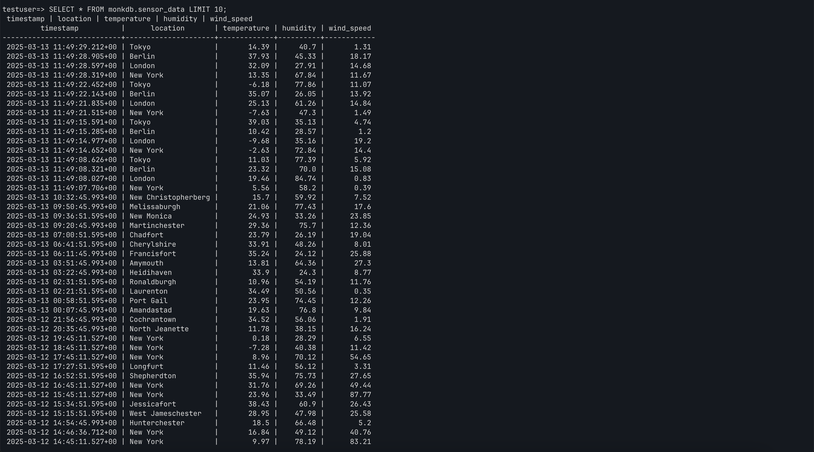

# Working with Timeseries Workloads Using MonkDB

## Simulation

In this demo, we are working with a synthetic time series data (on weather). We are inserting and querying the inserted data.

We are showing two modes.

- [Synchronous data workload](timeseries.py)
- [Asynchronous data workload](timeseries_async_data.py)

First up, a user needs to log in to the database using the below command.

FYI, the user named `testuser` with its password are already created in the previous step.

```zsh
$ psql -h localhost -p 5432 -U testuser -d monkdb -W
```
If successful, a user will be able to login and see the `psql` cli.

To run the simulation, we have created the below table in MonkDB. This table stores the data 
that is sent by the clients. 

```psql
CREATE TABLE IF NOT EXISTS sensor_data (timestamp TIMESTAMP WITH TIME ZONE PRIMARY KEY, location TEXT NOT NULL, temperature FLOAT NOT NULL, humidity FLOAT NOT NULL, wind_speed FLOAT NOT NULL);
```
You shall receive an output saying it is either successful or a failed attempt.

Next, let's run the [synchronous](timeseries.py) time series data and its associated script. If the execution is successful, you must receive an output like below

```zsh
Inserted 10 sensor records.

Recent Sensor Data (Last 24 Hours):
1741783511527 | New York | Temp: 27.94°C | Humidity: 40.4% | Wind Speed: 74.71 km/h
1741783596712 | New York | Temp: 17.94°C | Humidity: 60.44% | Wind Speed: 59.62 km/h
1741787111527 | New York | Temp: 33.72°C | Humidity: 54.21% | Wind Speed: 71.19 km/h
1741787196712 | New York | Temp: 3.71°C | Humidity: 79.0% | Wind Speed: 78.3 km/h
1741790711527 | New York | Temp: 9.97°C | Humidity: 78.19% | Wind Speed: 83.21 km/h
1741790796712 | New York | Temp: 16.84°C | Humidity: 49.12% | Wind Speed: 40.76 km/h
1741791285993 | Hunterchester | Temp: 18.5°C | Humidity: 66.48% | Wind Speed: 5.2 km/h
1741792551595 | West Jameschester | Temp: 28.95°C | Humidity: 47.98% | Wind Speed: 25.58 km/h
1741793691595 | Jessicafort | Temp: 38.43°C | Humidity: 60.9% | Wind Speed: 26.43 km/h
1741794311527 | New York | Temp: 23.96°C | Humidity: 33.49% | Wind Speed: 87.77 km/h
1741797911527 | New York | Temp: 31.76°C | Humidity: 69.26% | Wind Speed: 49.44 km/h
1741798371595 | Shepherdton | Temp: 35.94°C | Humidity: 75.73% | Wind Speed: 27.65 km/h
1741800471595 | Longfurt | Temp: 11.46°C | Humidity: 56.12% | Wind Speed: 3.31 km/h
1741801511527 | New York | Temp: 8.96°C | Humidity: 70.12% | Wind Speed: 54.65 km/h
1741805111527 | New York | Temp: -7.28°C | Humidity: 40.38% | Wind Speed: 11.42 km/h
1741808711527 | New York | Temp: 0.18°C | Humidity: 28.29% | Wind Speed: 6.55 km/h
1741811745993 | North Jeanette | Temp: 11.78°C | Humidity: 38.15% | Wind Speed: 16.24 km/h
1741816605993 | Cochrantown | Temp: 34.52°C | Humidity: 56.06% | Wind Speed: 1.91 km/h
1741824465993 | Amandastad | Temp: 19.63°C | Humidity: 76.8% | Wind Speed: 9.84 km/h
1741827531595 | Port Gail | Temp: 23.95°C | Humidity: 74.45% | Wind Speed: 12.26 km/h
1741832511595 | Laurenton | Temp: 34.49°C | Humidity: 50.56% | Wind Speed: 0.35 km/h
1741833111595 | Ronaldburgh | Temp: 10.96°C | Humidity: 54.19% | Wind Speed: 11.76 km/h
1741836165993 | Heidihaven | Temp: 33.9°C | Humidity: 24.3% | Wind Speed: 8.77 km/h
1741837905993 | Amymouth | Temp: 13.81°C | Humidity: 64.36% | Wind Speed: 27.3 km/h
1741846305993 | Francisfort | Temp: 35.24°C | Humidity: 24.12% | Wind Speed: 25.88 km/h
1741848111595 | Cherylshire | Temp: 33.91°C | Humidity: 48.26% | Wind Speed: 8.01 km/h
1741849251595 | Chadfort | Temp: 23.79°C | Humidity: 26.19% | Wind Speed: 19.04 km/h
1741857645993 | Martinchester | Temp: 29.36°C | Humidity: 75.7% | Wind Speed: 12.36 km/h
1741858611595 | New Monica | Temp: 24.93°C | Humidity: 33.26% | Wind Speed: 23.85 km/h
1741859445993 | Melissaburgh | Temp: 21.06°C | Humidity: 77.43% | Wind Speed: 17.6 km/h
1741861965993 | New Christopherberg | Temp: 15.7°C | Humidity: 59.92% | Wind Speed: 7.52 km/h
1741866547706 | New York | Temp: 5.56°C | Humidity: 58.2% | Wind Speed: 0.39 km/h
1741866548027 | London | Temp: 19.46°C | Humidity: 84.74% | Wind Speed: 0.83 km/h
1741866548321 | Berlin | Temp: 23.32°C | Humidity: 70.0% | Wind Speed: 15.08 km/h
1741866548626 | Tokyo | Temp: 11.03°C | Humidity: 77.39% | Wind Speed: 5.92 km/h
1741866554652 | New York | Temp: -2.63°C | Humidity: 72.84% | Wind Speed: 14.4 km/h
1741866554977 | London | Temp: -9.68°C | Humidity: 35.16% | Wind Speed: 19.2 km/h
1741866555285 | Berlin | Temp: 10.42°C | Humidity: 28.57% | Wind Speed: 1.2 km/h
1741866555591 | Tokyo | Temp: 39.03°C | Humidity: 35.13% | Wind Speed: 4.74 km/h
1741866561515 | New York | Temp: -7.63°C | Humidity: 47.3% | Wind Speed: 1.49 km/h
1741866561835 | London | Temp: 25.13°C | Humidity: 61.26% | Wind Speed: 14.84 km/h
1741866562143 | Berlin | Temp: 35.07°C | Humidity: 26.05% | Wind Speed: 13.92 km/h
1741866562452 | Tokyo | Temp: -6.18°C | Humidity: 77.86% | Wind Speed: 11.07 km/h
1741866568319 | New York | Temp: 13.35°C | Humidity: 67.84% | Wind Speed: 11.67 km/h
1741866568597 | London | Temp: 32.09°C | Humidity: 27.91% | Wind Speed: 14.68 km/h
1741866568905 | Berlin | Temp: 37.93°C | Humidity: 45.33% | Wind Speed: 18.17 km/h
1741866569212 | Tokyo | Temp: 14.39°C | Humidity: 40.7% | Wind Speed: 1.31 km/h
```

Next, let's run the [async](timeseries_async_data.py) version of timeseries simulation. If successful, you would keep receiving an output like below till you interrupt. Here, MonkDB is handling continuous stream of real time data from clients (hardware and software as well). Here, we are also querying the data immediately after data insertion for simulation. In ideal production environment, both the processes are handled seperately (insertion and querying).
```zsh
Inserted: {'timestamp': datetime.datetime(2025, 3, 13, 11, 49, 8, 27428), 'location': 'London', 'temperature': 19.46, 'humidity': 84.74, 'wind_speed': 0.83}
Inserted: {'timestamp': datetime.datetime(2025, 3, 13, 11, 49, 8, 321124), 'location': 'Berlin', 'temperature': 23.32, 'humidity': 70.0, 'wind_speed': 15.08}
Inserted: {'timestamp': datetime.datetime(2025, 3, 13, 11, 49, 8, 626251), 'location': 'Tokyo', 'temperature': 11.03, 'humidity': 77.39, 'wind_speed': 5.92}

Average Temperatures:
Location: New York, Avg Temp: 13.614736967965177
Location: Jessicafort, Avg Temp: 38.43000030517578
Location: Ronaldburgh, Avg Temp: 10.960000038146973
Location: Longfurt, Avg Temp: 11.460000038146973
Location: West Jameschester, Avg Temp: 28.950000762939453
Location: Shepherdton, Avg Temp: 35.939998626708984
Location: New Monica, Avg Temp: 24.93000030517578
Location: Tokyo, Avg Temp: 11.029999732971191
Location: London, Avg Temp: 19.459999084472656
Location: Cherylshire, Avg Temp: 33.90999984741211
Location: Chadfort, Avg Temp: 23.790000915527344
Location: Port Gail, Avg Temp: 23.950000762939453
Location: Laurenton, Avg Temp: 34.4900016784668

Recent Readings:
Timestamp: 1741866548626, Location: Tokyo, Temperature: 11.03, Humidity: 77.39, Wind Speed: 5.92
Timestamp: 1741866548321, Location: Berlin, Temperature: 23.32, Humidity: 70.0, Wind Speed: 15.08
Timestamp: 1741866548027, Location: London, Temperature: 19.46, Humidity: 84.74, Wind Speed: 0.83
Timestamp: 1741866547706, Location: New York, Temperature: 5.56, Humidity: 58.2, Wind Speed: 0.39
Timestamp: 1741858611595, Location: New Monica, Temperature: 24.93, Humidity: 33.26, Wind Speed: 23.85
Inserted: {'timestamp': datetime.datetime(2025, 3, 13, 11, 49, 14, 652116), 'location': 'New York', 'temperature': -2.63, 'humidity': 72.84, 'wind_speed': 14.4}
Inserted: {'timestamp': datetime.datetime(2025, 3, 13, 11, 49, 14, 977419), 'location': 'London', 'temperature': -9.68, 'humidity': 35.16, 'wind_speed': 19.2}
Inserted: {'timestamp': datetime.datetime(2025, 3, 13, 11, 49, 15, 285793), 'location': 'Berlin', 'temperature': 10.42, 'humidity': 28.57, 'wind_speed': 1.2}
Inserted: {'timestamp': datetime.datetime(2025, 3, 13, 11, 49, 15, 591824), 'location': 'Tokyo', 'temperature': 39.03, 'humidity': 35.13, 'wind_speed': 4.74}

Average Temperatures:
Location: New York, Avg Temp: 12.802500113844872
Location: Berlin, Avg Temp: 23.31999969482422
Location: Jessicafort, Avg Temp: 38.43000030517578
Location: Ronaldburgh, Avg Temp: 10.960000038146973
Location: Longfurt, Avg Temp: 11.460000038146973
Location: West Jameschester, Avg Temp: 28.950000762939453
Location: Shepherdton, Avg Temp: 35.939998626708984
Location: New Monica, Avg Temp: 24.93000030517578
Location: Tokyo, Avg Temp: 11.029999732971191
Location: London, Avg Temp: 4.8899993896484375
Location: Cherylshire, Avg Temp: 33.90999984741211
Location: Chadfort, Avg Temp: 23.790000915527344
Location: Port Gail, Avg Temp: 23.950000762939453
Location: Laurenton, Avg Temp: 34.4900016784668

Recent Readings:
Timestamp: 1741866555591, Location: Tokyo, Temperature: 39.03, Humidity: 35.13, Wind Speed: 4.74
Timestamp: 1741866555285, Location: Berlin, Temperature: 10.42, Humidity: 28.57, Wind Speed: 1.2
Timestamp: 1741866554977, Location: London, Temperature: -9.68, Humidity: 35.16, Wind Speed: 19.2
Timestamp: 1741866554652, Location: New York, Temperature: -2.63, Humidity: 72.84, Wind Speed: 14.4
Timestamp: 1741866548626, Location: Tokyo, Temperature: 11.03, Humidity: 77.39, Wind Speed: 5.92
Inserted: {'timestamp': datetime.datetime(2025, 3, 13, 11, 49, 21, 515861), 'location': 'New York', 'temperature': -7.63, 'humidity': 47.3, 'wind_speed': 1.49}
Inserted: {'timestamp': datetime.datetime(2025, 3, 13, 11, 49, 21, 835664), 'location': 'London', 'temperature': 25.13, 'humidity': 61.26, 'wind_speed': 14.84}
Inserted: {'timestamp': datetime.datetime(2025, 3, 13, 11, 49, 22, 143422), 'location': 'Berlin', 'temperature': 35.07, 'humidity': 26.05, 'wind_speed': 13.92}
Inserted: {'timestamp': datetime.datetime(2025, 3, 13, 11, 49, 22, 452167), 'location': 'Tokyo', 'temperature': -6.18, 'humidity': 77.86, 'wind_speed': 11.07}

Average Temperatures:
Location: New York, Avg Temp: 11.82952391249793
Location: Berlin, Avg Temp: 16.869999885559082
Location: Jessicafort, Avg Temp: 38.43000030517578
Location: Ronaldburgh, Avg Temp: 10.960000038146973
Location: Longfurt, Avg Temp: 11.460000038146973
Location: West Jameschester, Avg Temp: 28.950000762939453
Location: Shepherdton, Avg Temp: 35.939998626708984
Location: New Monica, Avg Temp: 24.93000030517578
Location: Tokyo, Avg Temp: 25.029999256134033
Location: London, Avg Temp: 11.636665980021158
Location: Cherylshire, Avg Temp: 33.90999984741211
Location: Chadfort, Avg Temp: 23.790000915527344
Location: Port Gail, Avg Temp: 23.950000762939453
Location: Laurenton, Avg Temp: 34.4900016784668

Recent Readings:
Timestamp: 1741866561835, Location: London, Temperature: 25.13, Humidity: 61.26, Wind Speed: 14.84
Timestamp: 1741866561515, Location: New York, Temperature: -7.63, Humidity: 47.3, Wind Speed: 1.49
Timestamp: 1741866555591, Location: Tokyo, Temperature: 39.03, Humidity: 35.13, Wind Speed: 4.74
Timestamp: 1741866555285, Location: Berlin, Temperature: 10.42, Humidity: 28.57, Wind Speed: 1.2
Timestamp: 1741866554977, Location: London, Temperature: -9.68, Humidity: 35.16, Wind Speed: 19.2
Inserted: {'timestamp': datetime.datetime(2025, 3, 13, 11, 49, 28, 319685), 'location': 'New York', 'temperature': 13.35, 'humidity': 67.84, 'wind_speed': 11.67}
Inserted: {'timestamp': datetime.datetime(2025, 3, 13, 11, 49, 28, 597670), 'location': 'London', 'temperature': 32.09, 'humidity': 27.91, 'wind_speed': 14.68}
Inserted: {'timestamp': datetime.datetime(2025, 3, 13, 11, 49, 28, 905456), 'location': 'Berlin', 'temperature': 37.93, 'humidity': 45.33, 'wind_speed': 18.17}
Inserted: {'timestamp': datetime.datetime(2025, 3, 13, 11, 49, 29, 212982), 'location': 'Tokyo', 'temperature': 14.39, 'humidity': 40.7, 'wind_speed': 1.31}
...
...
```

We are also attaching the output from MonkDB's terminal in tabular format.




A user or organization can extend these examples to production scenarios where data is fed from pipelines comprising components such as Apache Kafka, Apache Flink, and Apache Pulsar. This is mentioned because the data is assumed to be cleaned before being stored in MonkDB.

---

## Accessing the tables (only superusers)

- If you want to check or list the tables under `monkdb` schema, execute the `psql` command.

```psql
SELECT table_name FROM information_schema.tables where table_schema = 'monkdb';
```
It will respond with an output like below

```psql
testuser=> SELECT table_name FROM information_schema.tables where table_schema = 'monkdb';
 table_name
-------------
 sensor_data
(1 row)
```

- If a user wants to check the schema/structure of a table, please execute the below `psql` statement. 

```psql
SELECT column_name, data_type, is_nullable FROM information_schema.columns WHERE table_schema = 'monkdb' AND table_name = 'sensor_data';
```

A user would receive an output as shown below.

```psql
testuser=> SELECT column_name, data_type, is_nullable FROM information_schema.columns WHERE table_schema = 'monkdb' AND table_name = 'sensor_data';
 column_name |        data_type         | is_nullable
-------------+--------------------------+-------------
 timestamp   | timestamp with time zone | f
 location    | text                     | f
 temperature | real                     | f
 humidity    | real                     | f
 wind_speed  | real                     | f
(5 rows)
```

- If a user wants to see the SQL statement that was used to create a table, please execute the below statement.

```psql
SHOW CREATE TABLE monkdb.sensor_data;
```

A user would receive an output as shown below.

```psql
testuser=> SHOW CREATE TABLE monkdb.sensor_data;
        SHOW CREATE TABLE monkdb.sensor_data
-----------------------------------------------------
 CREATE TABLE IF NOT EXISTS "monkdb"."sensor_data" (+
    "timestamp" TIMESTAMP WITH TIME ZONE NOT NULL,  +
    "location" TEXT NOT NULL,                       +
    "temperature" REAL NOT NULL,                    +
    "humidity" REAL NOT NULL,                       +
    "wind_speed" REAL NOT NULL,                     +
    PRIMARY KEY ("timestamp")                       +
 )                                                  +
 CLUSTERED BY ("timestamp") INTO 4 SHARDS           +
 WITH (                                             +
    column_policy = 'strict',                       +
    number_of_replicas = '0-1'                      +
 )
(1 row)
```

---

**PS**: In MonkDB, we cannot create multiple database schemas. By default, all tables, etc. are stored
under `monkdb`. For example, in this SQL statement `INSERT INTO monkdb.sensor_data`, table `sensor_data` is stored under
`monkdb` schema. However, we can configure privileges for users on tables, etc. 


